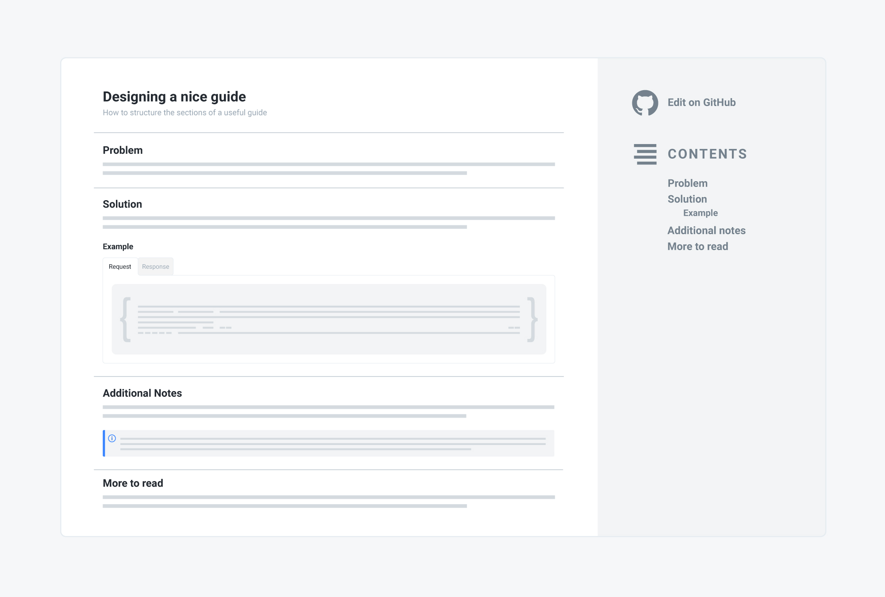

# Intro

Need to fetch prices and inventory, manage shopping carts, customer accounts, or checkout orders? This collection of guides and step-by-step tutorials is what you need, featuring how-tos, handy examples, and best practices for the most common scenarios.

## How it works

Each guide roughly follows the same schema and is developed across four main sections:

1. **Problem** A presentation of the issue you are facing.
2. **Solution** The recommended way to solve the problem. This is where you find the API calls you need to make, along with request/response detailed examples.
3. **Additional notes** A special focus and some highlights of critical aspects around the topic, best practices, suggestions and more in-depth information.
4. **More to read** Links to the API reference, articles, blog posts, or any other resource that can help you getting more information about the subject.

## Ask for more!

We are working hard to make our documentation as helpful as possible. This list of guides is constantly growing and will be regularly updated. Anyway, if you don't find what you need, feel free to contact our support team at any time or contribute by sending your PR on Github!
