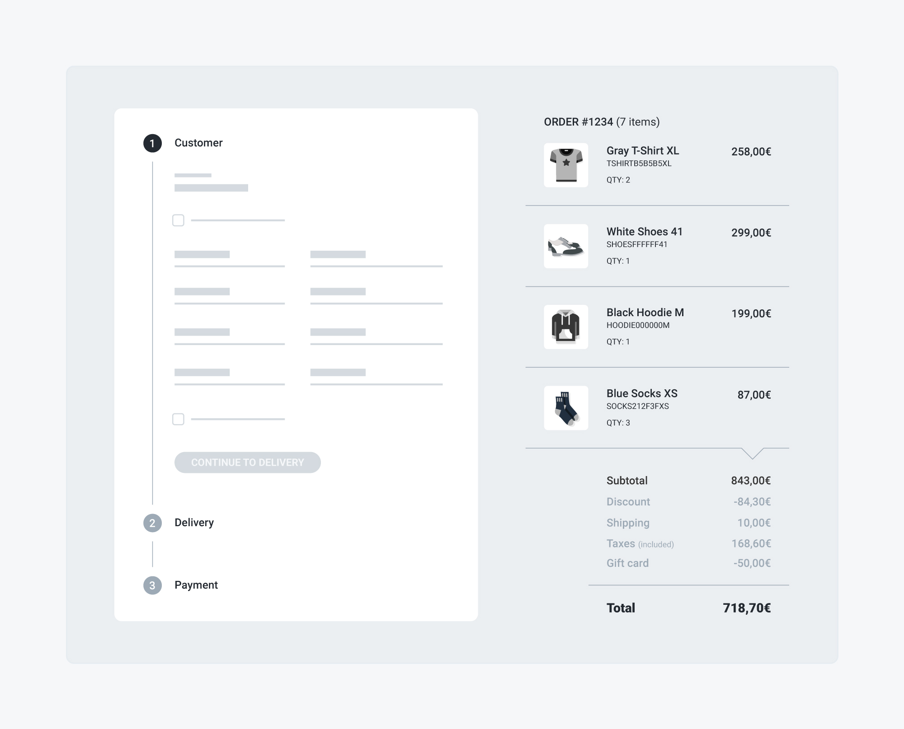

# Checkout

The checkout process is the process that a customer must go through when purchasing the items in their shopping cart. The customer can be either a _guest_ — i.e. they proceed by just providing an email address — or _logged_ — i.e. they authenticate themselves with a password. When logged in, the customer gains access to their private data, such as their saved addresses and credit cards, making the process faster.

This guide will walk you through all the actions that you generally need to implement when building a **custom checkout experience** for your customers. We recommend you to have a look at our [open-source checkout application](https://github.com/commercelayer/commercelayer-checkout) for a fully functional, production-ready reference.

