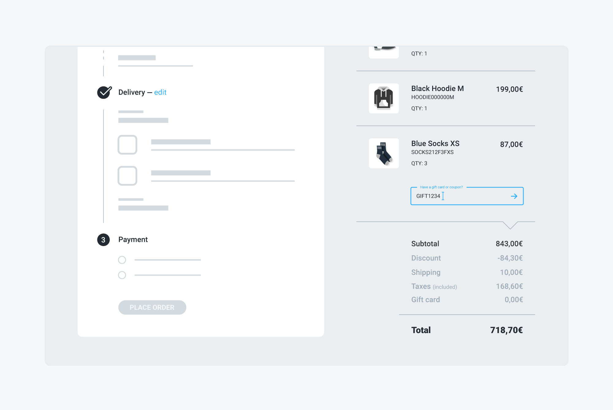

# Adding a gift card or coupon

## Problem

You have a pending order and you want to give your customer the possibility to add a gift card or coupon code to the order, so that they get the associated discount.



## Solution

To add a gift card or coupon code to an order, send a `PATCH` request to the `/api/orders/:id` endpoint, setting the `gift_card_or_coupon_code` attribute to the desired value. If an active gift card or coupon code matches that value — with at least the first 8 digits — the order amounts are updated according to the associated gift card balance or coupon discount.


In the unlikely event that both a gift card and a coupon code match the same code, the gift card takes the precedence.


The image below shows how the related action during the checkout process is mapped to a specific attribute of the order object.


### Example



 The following request add the gift card identified by the "GIFT1234-ABC" code to the order identified by the "NgojhKoyYN" ID:

```javascript
curl -X PATCH \
  https://yourdomain.commercelayer.io/api/orders/NgojhKoyYN \
  -H 'Authorization: Bearer your-access-token' \
  -H 'Accept: application/vnd.api+json' \
  -H 'Content-Type: application/vnd.api+json' \
  -d '{
    "data": {
      "type": "orders",
      "id": "NgojhKoyYN",
      "attributes": {
        "gift_card_or_coupon_code": "GIFT1234-ABC"
      }
    }
  }'
```



On success, the API responds with a `200 OK` status code, returning the updated order object:

```javascript
{
  "data": {
    "id": "NgojhKoyYN",
    "type": "orders",
    "links": {
      "self": "https://yourdomain.commercelayer.io/api/orders/NgojhKoyYN"
    },
    "attributes": {
      "number": 1234,
      "status": "pending",
      "payment_status": "authorized",
      "fulfillment_status": "unfulfilled",
      "guest": true,
      "editable": true,
      "placeable": true,
      "customer_email": "john@example.com",
      "language_code": "en",
      "currency_code": "EUR",
      "tax_included": true,
      "tax_rate": 0.22,
      "freight_taxable": true,
      "requires_billing_info": false,
      "country_code": "IT",
      "shipping_country_code_lock": null,
      "coupon_code": "COUPON12-345",
      "gift_card_code": "GIFT1234-ABC",
      "gift_card_or_coupon_code": "GIFT1234-ABC",
      "subtotal_amount_cents": 84300,
      "subtotal_amount_float": 843.0,
      "formatted_subtotal_amount": "€843,00",
      "shipping_amount_cents": 1000,
      "shipping_amount_float": 10.0,
      "formatted_shipping_amount": "€10,00",
      "payment_method_amount_cents": 0,
      "payment_method_amount_float": 0.0,
      "formatted_payment_method_amount": "€0,00",
      "discount_amount_cents": -8430,
      "discount_amount_float": -84.30,
      "formatted_discount_amount": "-€84,30",
      "adjustment_amount_cents": 0,
      "adjustment_amount_float": 0.0,
      "formatted_adjustment_amount": "€0,00",
      "gift_card_amount_cents": -5000,
      "gift_card_amount_float": -50.0,
      "formatted_gift_card_amount": "-€50,00",
      "total_tax_amount_cents": 16860,
      "total_tax_amount_float": 168.60,
      "formatted_total_tax_amount": "€168,60",
      ...
      "other": "more order attributes",
      ...
      "total_amount_with_taxes_cents": 71870,
      "total_amount_with_taxes_float": 718.70,
      "formatted_total_amount_with_taxes": "€718,70",
      "fees_amount_cents": 0,
      "fees_amount_float": 0.0,
      "formatted_fees_amount": "€0,00",
      "skus_count": 7,
      "line_item_options_count": 0,
      "shipments_count": 0,
      "payment_source_details": null,
      "token": "your-order-token",
      "cart_url": null,
      "return_url": null,
      "terms_url": null,
      "privacy_url": null,
      "checkout_url": "https://checkout.yourdomain.com/NgojhKoyYN",
      "placed_at": null,
      "approved_at": null,
      "cancelled_at": null,
      "payment_updated_at": null,
      "fulfillment_updated_at": null,
      "created_at": "2018-01-01T12:00:00.000Z",
      "updated_at": "2018-01-01T12:00:00.000Z",
      "reference": null,
      "metadata": {}
    },
    "relationships": {
      "market": {
        "links": {...}
      },
      "customer": {
        "links": {...}
      },
      "shipping_address": {
        "links": {...}
      },
      "billing_address": {
        "links": {...}
      },
      "available_payment_methods": {
        "links": {...}
      },
      "payment_method": {
        "links": {...}
      },
      "payment_source": {
        "links": {...}
      },
      "line_items": {
        "links": {...}
      },
      "shipments": {
        "links": {...}
      }
    },
    "meta": {
      "mode": "test"
    }
  }
}
```



## Additional notes

#### Separating the gift card and coupon fields

Using the `gift_card_or_coupon_code` attribute is a convenient way of managing the most common use case, when you have just one field that can accept both types of code. In case you need to manage gift cards or coupon code fields separately, you can use the  `gift_card_code` or the `coupon_code` attributes instead.

#### Removing a gift card or coupon code

In case you want to remove a gift card or coupon code from the order — resetting any applied discount — you need to send a blank value to either the `gift_card_code` or `coupon_code` field.

## More to read

See our API reference if you need more information about the [gift card](https://docs.commercelayer.io/api/resources/gift_cards) object and its attributes or on how to [update an order](https://docs.commercelayer.io/api/resources/orders/update_order).


