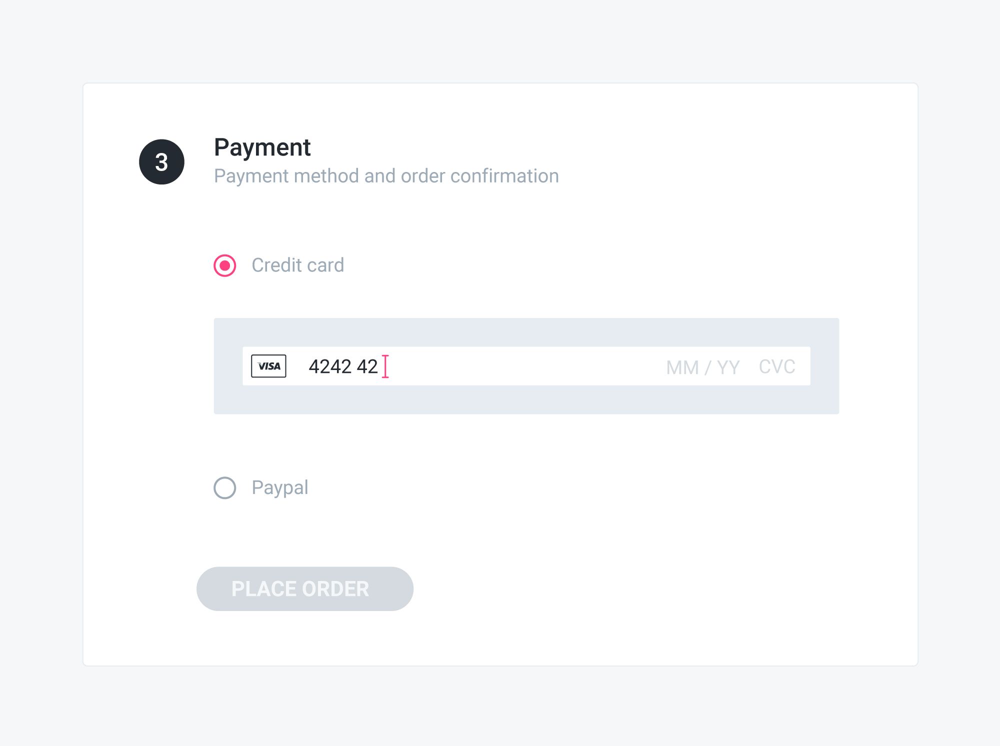

# Adding a payment source

## Problem

You have a pending order with a selected payment method and you want to give your customer the possibility to select a payment source — e.g. a credit card — to be used to pay for the order.

## Solution

Depending on the [payment source type](selecting-a-payment-method.md#payment-source-types) — defined by the payment method associated to the order — you need to follow a slightly different flow. Please refer to the payments guide for detailed information.



