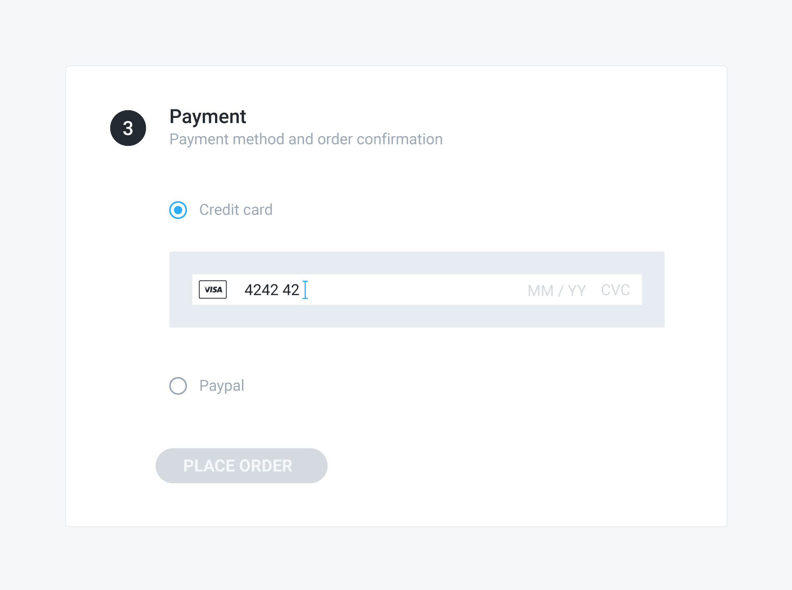

# Adding a payment source

## Problem

You have a pending order with a selected payment method and you want to give your customer the possibility to select a payment source — e.g. a credit card — to be used to pay for the order.

## Solution

Depending on the [payment source type](selecting-a-payment-method.md#payment-source-types) — defined by the payment method associated with the order — you need to follow a slightly different flow. 

Generally speaking, the first step in any implementation of the flow is the creation of the payment source object and its association with the order. To do that, you need to know the payment source endpoint. If you don't, you need to retrieve the `payment_source_type` attribute value from the payment method associated with the order first.

#### 1. Getting the payment source type

To get the payment source type, send a `GET` request to the `/api/orders/:id` endpoint, including the associated payment method, and read its `payment_source_type` attribute value from the response.

#### 2. Creating the payment source object

To create the payment source object and associate it with the order, you need to send a `POST` request to an endpoint that is different for each payment source. That means you need to _dynamically_ build the request URL based on the `payment_source_type` attribute value of the selected payment — i.e.`/api/:payment_source_type` — and fill the request payload with the specific attributes required by each payment gateway and the relationship with the order.

The structure of the payment source object you receive in the response will differ based on the specific payment source type, because each payment gateway or service has a different integration pattern. As a consequence of that, the subsequent payment flow will be dependent on the specific payment source that is associated with the order.

Please refer to the payments guide for detailed information and examples, according to the payment gateway you're using.



