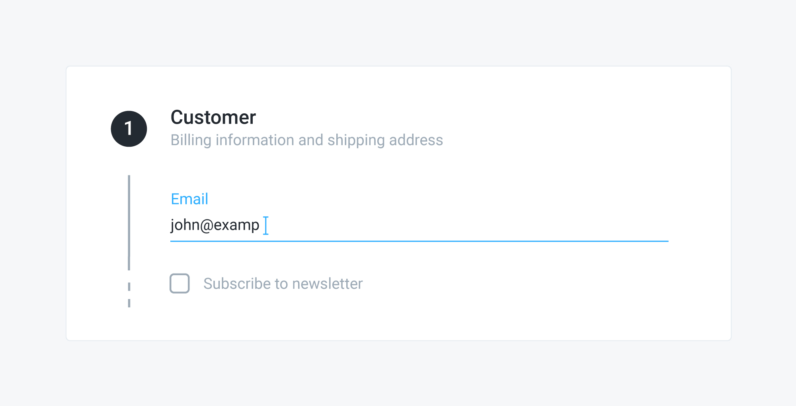

# Adding the customer

## Problem

You need to add a customer to a draft order, for example as the first step of the order checkout flow. 



## Solution

The easiest way to set the customer of an order is to change its `customer_email` attribute. To do that, send a `PATCH` request to the `/api/orders/:id` endpoint. 


In case a customer with the same email address exists in your organization, that customer is associated with the order, otherwise a new customer is created.


### Example



The following request associates the customer identified by the email address "john@example.com" with the order identified by the "NgojhKoyYN" ID:

```javascript
curl -X PATCH \
  https://yourdomain.commercelayer.io/api/orders/NgojhKoyYN \
  -H 'Accept: application/vnd.api+json' \
  -H 'Authorization: Bearer your-access-token' \
  -H 'Content-Type: application/vnd.api+json' \
  -d '{
    "data": {
      "type": "orders",
      "id": "NgojhKoyYN",
      "attributes": {
        "customer_email": "john@example.com"
      }
    }
  }'
```



On success, the API responds with a `200 OK` status code, returning the updated order object:

```javascript
{
  "data": {
    "id": "NgojhKoyYN",
    "type": "orders",
    "links": {
      "self": "https://yourdomain.commercelayer.io/api/orders/NgojhKoyYN"
    },
    "attributes": {
      "number": 1234,
      "status": "pending",
      "payment_status": "unpaid",
      "fulfillment_status": "unfulfilled",
      "guest": true,
      "editable": true,
      "placeable": false,
      "customer_email": "john@example.com",
      "language_code": "en",
      "currency_code": "EUR",
      "tax_included": true,
      "tax_rate": 0.2,
      "freight_taxable": true,
      "requires_billing_info": true,
      "country_code": "IT",
      "shipping_country_code_lock": null,
      "coupon_code": "COUPON12-345",
      "gift_card_code": null,
      "gift_card_or_coupon_code": null,
      "subtotal_amount_cents": 84300,
      "subtotal_amount_float": 843.0,
      "formatted_subtotal_amount": "€843,00",
      "shipping_amount_cents": 0,
      "shipping_amount_float": 0.0,
      "formatted_shipping_amount": "€0,00",
      "payment_method_amount_cents": 0,
      "payment_method_amount_float": 0.0,
      "formatted_payment_method_amount": "€0,00",
      "discount_amount_cents": -8430,
      "discount_amount_float": -84.30,
      "formatted_discount_amount": "-€84,30",
      "adjustment_amount_cents": 0,
      "adjustment_amount_float": 0.0,
      "formatted_adjustment_amount": "€0,00",
      "gift_card_amount_cents": 0,
      "gift_card_amount_float": 0.0,
      "formatted_gift_card_amount": "0,00",
      "total_tax_amount_cents": 16860,
      "total_tax_amount_float": 168.60,
      "formatted_total_tax_amount": "€168,60",
      ...
      "other": "more order attributes",
      ...
      "total_amount_with_taxes_cents": 76870,
      "total_amount_with_taxes_float": 768.70,
      "formatted_total_amount_with_taxes": "€768,70",
      "fees_amount_cents": 0,
      "fees_amount_float": 0.0,
      "formatted_fees_amount": "€0,00",
      "skus_count": 7,
      "line_item_options_count": 0,
      "shipments_count": 0,
      "payment_source_details": null,
      "token": "your-order-token",
      "cart_url": null,
      "return_url": null,
      "terms_url": null,
      "privacy_url": null,
      "checkout_url": "https://checkout.yourdomain.com/NgojhKoyYN",
      "placed_at": null,
      "approved_at": null,
      "cancelled_at": null,
      "payment_updated_at": null,
      "fulfillment_updated_at": null,
      "created_at": "2018-01-01T12:00:00.000Z",
      "updated_at": "2018-01-01T12:00:00.000Z",
      "reference": null,
      "metadata": {}
    },
    "relationships": {
      "market": {
        "links": {...}
      },
      "customer": {
        "links": {...}
      },
      "shipping_address": {
        "links": {...}
      },
      "billing_address": {
        "links": {...}
      },
      "available_payment_methods": {
        "links": {...}
      },
      "payment_method": {
        "links": {...}
      },
      "payment_source": {
        "links": {...}
      },
      "line_items": {
        "links": {...}
      },
      "shipments": {
        "links": {...}
      }
    },
    "meta": {
      "mode": "test"
    }
  }
}
```



### Mapping

The image below shows how the related field of an email form is mapped to a specific attribute of the order object.


## Logged customers

In case you checkout an order with a logged customer — i.e. using a customer token — the customer associated to the order is forced to be the same as the customer associated to the token and there is no way to explicitly change it. So all you need to do to associate the logged customer to the order is send a `PATCH` request to the `/api/orders/:id` endpoint, with empty attributes.

## Additional notes

#### Newsletter subscription

When adding a customer to an order, you might want to prompt the customer to subscribe to your newsletter. This can be easily achieved by creating a `customer_subscription` resource, using the customer email and any subscription `reference` — e.g. "Newsletter".

#### Abandoned cart recovery

When you add a customer to a `draft` order, the order status changes to `pending` . Pending orders are suitable to be recovered with specific marketing campaigns, as they contain a way to contact the customer even if the order has not been placed yet.

## More to read

See our API reference if you need more information on how to [update an order](https://docs.commercelayer.io/api/resources/orders/update_order), [get a customer token](https://docs.commercelayer.io/api/authentication/password) or [create a subscription](https://docs.commercelayer.io/api/resources/customer_subscriptions/create_customer_subscription).

