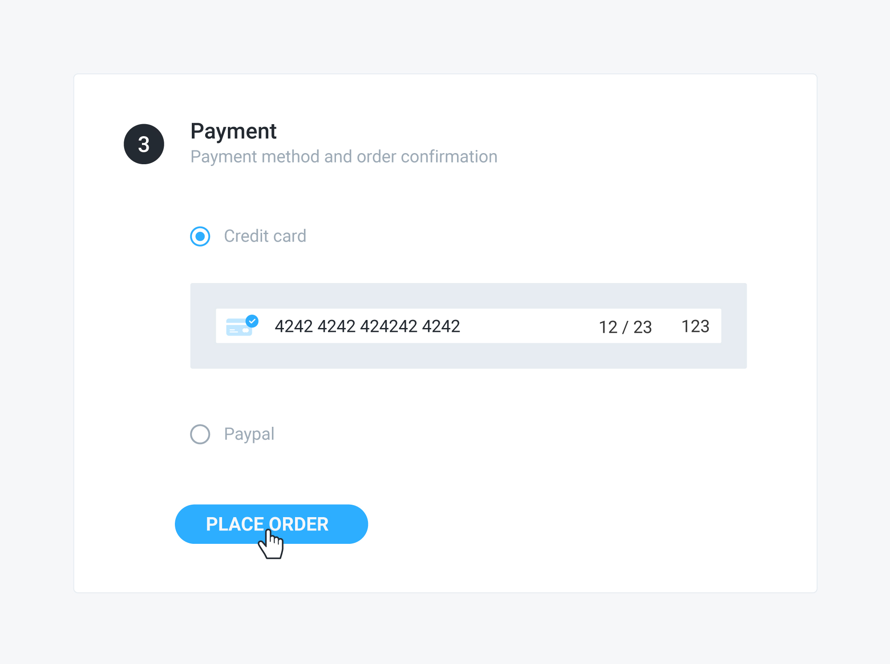

# Placing the order

## Problem

You have a pending order and you want to place it, authorizing the associated payment source.



## Solution

To place an order, send a `PATCH` request to the `/api/orders/:id` endpoint, setting the `_place` attribute to `true`. If the order is valid — i.e. it has all the required information — the associated payment source is authorized and the order status changes to `placed`.

### Example



 The following request places the order identified by the "NgojhKoyYN" ID:

```javascript
curl -X PATCH \
  https://yourdomain.commercelayer.io/api/orders/NgojhKoyYN \
  -H 'Authorization: Bearer your-access-token' \
  -H 'Accept: application/vnd.api+json' \
  -H 'Content-Type: application/vnd.api+json' \
  -d '{
    "data": {
      "type": "orders",
      "id": "NgojhKoyYN",
      "attributes": {
        "_place": true
      }
    }
  }'
```



On success, the API responds with a `200 OK` status code, returning the updated order object:

```javascript
{
  "data": {
    "id": "NgojhKoyYN",
    "type": "orders",
    "links": {
      "self": "https://yourdomain.commercelayer.io/api/orders/NgojhKoyYN"
    },
    "attributes": {
      "number": 1234,
      "status": "placed",
      "payment_status": "authorized",
      "fulfillment_status": "unfulfilled",
      "guest": true,
      "editable": false,
      "placeable": false,
      "customer_email": "john@example.com",
      "language_code": "en",
      "currency_code": "EUR",
      "tax_included": true,
      "tax_rate": 0.22,
      "freight_taxable": true,
      "requires_billing_info": true,
      "country_code": "IT",
      "shipping_country_code_lock": null,
      "coupon_code": "COUPON12-345",
      "gift_card_code": "GIFT1234-ABC",
      "gift_card_or_coupon_code": "GIFT1234-ABC",
      "subtotal_amount_cents": 84300,
      "subtotal_amount_float": 843.0,
      "formatted_subtotal_amount": "€843,00",
      "shipping_amount_cents": 1000,
      "shipping_amount_float": 10.0,
      "formatted_shipping_amount": "€10,00",
      "payment_method_amount_cents": 0,
      "payment_method_amount_float": 0.0,
      "formatted_payment_method_amount": "€0,00",
      "discount_amount_cents": -8430,
      "discount_amount_float": -84.30,
      "formatted_discount_amount": "-€84,30",
      "adjustment_amount_cents": 0,
      "adjustment_amount_float": 0.0,
      "formatted_adjustment_amount": "€0,00",
      "gift_card_amount_cents": -5000,
      "gift_card_amount_float": -50.0,
      "formatted_gift_card_amount": "-€50,00",
      "total_tax_amount_cents": 16860,
      "total_tax_amount_float": 168.60,
      "formatted_total_tax_amount": "€168,60",
      ...
      "other": "more order attributes",
      ...
      "total_amount_with_taxes_cents": 71870,
      "total_amount_with_taxes_float": 718.70,
      "formatted_total_amount_with_taxes": "€718,70",
      "fees_amount_cents": 0,
      "fees_amount_float": 0.0,
      "formatted_fees_amount": "€0,00",
      "skus_count": 7,
      "line_item_options_count": 0,
      "shipments_count": 0,
      "payment_source_details": {
        "type": "credit_card"
      },
      "token": "your-order-token",
      "cart_url": null,
      "return_url": null,
      "terms_url": null,
      "privacy_url": null,
      "checkout_url": "https://checkout.yourdomain.com/NgojhKoyYN",
      "placed_at": "2018-02-01T12:00:00.000Z",
      "approved_at": null,
      "cancelled_at": null,
      "payment_updated_at": null,
      "fulfillment_updated_at": null,
      "created_at": "2018-01-01T12:00:00.000Z",
      "updated_at": "2018-01-01T12:00:00.000Z",
      "reference": null,
      "metadata": {}
    },
    "relationships": {
      "market": {
        "links": {...}
      },
      "customer": {
        "links": {...}
      },
      "shipping_address": {
        "links": {...}
      },
      "billing_address": {
        "links": {...}
      },
      "available_payment_methods": {
        "links": {...}
      },
      "payment_method": {
        "links": {...}
      },
      "payment_source": {
        "links": {...}
      },
      "line_items": {
        "links": {...}
      },
      "shipments": {
        "links": {...}
      }
    },
    "meta": {
      "mode": "test"
    }
  }
}
```



## Additional notes

#### Asynchronous callbacks

After an order has been successfully placed, the following actions are performed asynchronously:

* The customer orders count is increased
* The order stock items are decremented
* The status of any order shipment is set to `upcoming`
* The status of any purchased gift cards is set to `active`
* The usage count of any associated promotion is incremented
* The usage count of any associated coupon is incremented
* The usage count of any associated gift card is incremented
* The status of any associated single-use gift card is se to `redeemed`

## More to read

See our API reference if you need more information about the [stock item](https://docs.commercelayer.io/api/resources/stock_items), [shipment](https://docs.commercelayer.io/api/resources/shipments) and [gift card](https://docs.commercelayer.io/api/resources/gift_cards) objects or on how to [update an order](https://docs.commercelayer.io/api/resources/orders/update_order).

