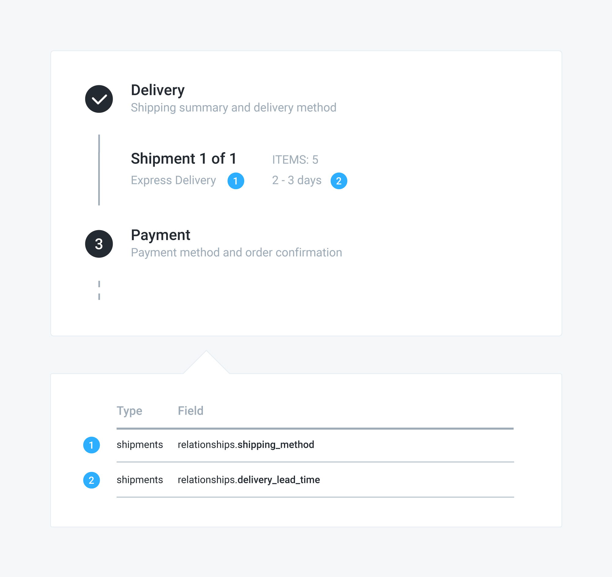

# Selecting a shipping method

## Problem

You have a pending order and you want to give your customer the possibility to select a shipping method for each of the order shipments, based on its cost and delivery lead time.


## Solution

Within Commerce Layer, an order can have many shipments and each shipment must have a valid shipping method before the order can be placed. To let the customer select a shipping method, first you need to get the list of available shipping methods for the order shipments and display them to the customer along with their delivery lead times. Then you can associate the selected shipping method with the shipment and eventually display its delivery lead time. To do that:

1. Send a `GET` request to the `/api/orders/:id/shipments` endpoint, including the associated `available_shipping_methods` and `stock_location`. 
2. Send a `GET` request to the `/api/orders/delivery_lead_times`, including the associated `shipping_method` and `stock_location`, and add some front-end logic to determine which of the returned delivery lead times is associated with a stock location that matches the one associated with the shipment. 
3. Send a `PATCH` request to the `/api/shipments/:id` endpoint, setting its `shipping_method` relationship.
4. Send a `GET` request to the `/api/shipments/:id endpoint`, including the associated `shipping_method` and `delivery_lead_time`.


Including the stock location in the API calls above is necessary to be able to display the correct delivery lead time especially in case the order is split into many shipments. 


### Example

#### 1. Get the available shipping methods



The following request retrieves the list of available shipping methods associated with the shipments of the order identified by the "NgojhKoyYN" ID:

```javascript
curl -X GET \
  https://yourdomain.commercelayer.io/api/orders/NgojhKoyYN/shipments?include=available_shipping_methods,stock_location \
  -H 'Authorization: Bearer your-access-token' \
  -H 'Accept: application/vnd.api+json'
```



On success, the API responds with a `200 OK` status code, returning the list of shipment  objects and the associated available shipping methods and stock locations:

```javascript
{
  "data": [
    {
      "id": "kPzgnCjdQy",
      "type": "shipments",
      "links": {
        "self": "https://yourdomain.commercelayer.io/api/shipments/kPzgnCjdQy"
      },
      "attributes": {
        "number": "1234/S/001",
        "status": "upcoming",
        "currency_code": "EUR",
        "cost_amount_cents": 0,
        "cost_amount_float": 0.0,
        "formatted_cost_amount": "$0.00",
        "skus_count": 4,
        "created_at": "2018-01-01T12:00:00.000Z",
        "updated_at": "2018-01-01T12:00:00.000Z",
        "reference": null,
        "metadata": {}
      },
      "relationships": {
        "order": {
          "links": {...}
        },
        "shipping_category": {
          "links": {...}
        },
        "stock_location": {
          "links": {...}
          "data": {
            "type": "stock_locations",
            "id": "DMzAouwyXk"
          }
        },
        "origin_address": {
          "links": {...}
        },
        "shipping_address": {
          "links": {...}
        },
        "shipping_method": {
          "links": {...}
        },
        "delivery_lead_time": {
          "links": {...}
        },
        "shipment_line_items": {
          "links": {...}
        },
        "stock_transfers": {
          "links": {...}
        },
        "available_shipping_methods": {
          "links": {...},
          "data": [
            {
              "type": "shipping_methods",
              "id": "WErDzFLeQN"
            },
            {
              "type": "shipping_methods",
              "id": "DEqjzFMykO"
            }
          ]
        },
        "carrier_accounts": {
          "links": {...}
        },
        "parcels": {
          "links": {...}
        },
        "attachments": {...}
        }
      },
      "meta": {
          "mode": "test"
      }
    }
  ],
  "included": [
    {
      "id": "DMzAouwyXk",
      "type": "stock_locations",
      "links": {...},
      "attributes": {
        "number": 1234,
        "name": "Primary Warehouse",
        "label_format": "PDF",
        "suppress_etd": null,
        "created_at": "2018-01-01T12:00:00.000Z",
        "updated_at": "2018-01-01T12:00:00.000Z",
        "reference": null,
        "reference_origin": null,
        "metadata": {}
      },
      "relationships": {
        "address": {
            "links": {...}
        },
        "inventory_stock_locations": {
            "links": {...}
        },
        "inventory_return_locations": {
            "links": {...}
        },
        "stock_items": {
            "links": {...}
        },
        "stock_transfers": {
            "links": {...}
        },
        "attachments": {
            "links": {...}
        }
      },
      "meta": {
          "mode": "test"
      }
    },
    {
      "id": "WErDzFLeQN",
      "type": "shipping_methods",
      "links": {
          "self": "https://yourdomain.commercelayer.io/api/shipping_methods/WErDzFLeQN"
      },
      "attributes": {
        "name": "Standard Shipping",
        "disabled_at": null,
        "currency_code": "EUR",
        "price_amount_cents": 700,
        "price_amount_float": 7.0,
        "formatted_price_amount": "€7,00",
        "free_over_amount_cents": 9900,
        "free_over_amount_float": 99.0,
        "formatted_free_over_amount": "€99,00",
        "price_amount_for_shipment_cents": 0,
        "price_amount_for_shipment_float": 0.0,
        "formatted_price_amount_for_shipment": "€0,00",
        "created_at": "2018-01-01T12:00:00.000Z",
        "updated_at": "2018-01-01T12:00:00.000Z",
        "reference": null,
        "metadata": {}
      },
      "relationships": {
        "market": {
          "links": {...}
        },
        "shipping_zone": {
          "links": {...}
        },
        "shipping_category": {
          "links": {...}
        },
        "delivery_lead_time_for_shipment": {
          "links": {...}
        },
        "attachments": {
          "links": {...}
        }
      },
      "meta": {
        "mode": "test"
      }
    },
    {
      "id": "DEqjzFMykO",
      "type": "shipping_methods",
      "links": {
        "self": "https://yourdomain.commercelayer.io/api/shipping_methods/DEqjzFMykO"
      },
      "attributes": {
        "name": "Express Delivery",
        "disabled_at": null,
        "currency_code": "EUR",
        "price_amount_cents": 1200,
        "price_amount_float": 12.0,
        "formatted_price_amount": "€10,00",
        "free_over_amount_cents": null,
        "free_over_amount_float": null,
        "formatted_free_over_amount": null,
        "price_amount_for_shipment_cents": 1200,
        "price_amount_for_shipment_float": 12.0,
        "formatted_price_amount_for_shipment": "€12,00",
        "created_at": "2018-01-01T12:00:00.000Z",
        "updated_at": "2018-01-01T12:00:00.000Z",
        "reference": null,
        "metadata": {}
      },
      "relationships": {
        "market": {
          "links": {..}
        },
        "shipping_zone": {
          "links": {...}
        },
        "shipping_category": {
          "links": {...}
        },
        "delivery_lead_time_for_shipment": {
          "links": {...}
        },
        "attachments": {
          "links": {...}
        }
      },
      "meta": {
        "mode": "test"
      }
    }
  ],
  "meta": {
    "record_count": 1,
    "page_count": 1
  },
  "links": {
      "first": "https://yourdomain.commercelayer.io/api/orders/NgojhKoyYN/shipments?include=available_shipping_methods,stock_location&page[number]=1&page[size]=10",
      "last": "https://yourdomain.commercelayer.io/api/orders/NgojhKoyYN/shipments?include=available_shipping_methods,stock_location&page[number]=1&page[size]=10"
  }
}
```



#### 2. Displaying the available shipping methods delivery lead times



The following request retrieves the list of the delivery lead times for the market in scope:

```javascript
curl -X GET \
  https://yourdomain.commercelayer.io/api/delivery_lead_times?include=shipping_method,stock_location \
  -H 'Authorization: Bearer your-access-token' \
  -H 'Accept: application/vnd.api+json'
```



On success, the API responds with a `200 OK` status code, returning the list of delivery lead time objects and the associated shipping methods and stock locations:

```javascript
{
  "data": [
    {
      "id": "nOZwqFYXQB",
      "type": "delivery_lead_times",
      "links": {...},
      "attributes": {
        "min_hours": 72,
        "max_hours": 120,
        "min_days": 3,
        "max_days": 5,
        "created_at": "2018-01-01T12:00:00.000Z",
        "updated_at": "2018-01-01T12:00:00.000Z",
        "reference": null,
        "reference_origin": null,
        "metadata": {}
      },
      "relationships": {
        "stock_location": {
          "links": {...},
          "data": {
            "type": "stock_locations",
            "id": "DMzAouwyXk"
          }
        },
        "shipping_method": {
          "links": {...},
          "data": {
            "type": "shipping_methods",
            "id": "WErDzFLeQN"
          }
        },
        "attachments": {
          "links": {...}
        }
      },
      "meta": {
        "mode": "test"
      }
    },
    {
      "id": "AxwloFjQbp",
      "type": "delivery_lead_times",
      "links": {...},
      "attributes": {
        "min_hours": 48,
        "max_hours": 72,
        "min_days": 2,
        "max_days": 3,
        "created_at": "2018-01-01T12:00:00.000Z",
        "updated_at": "2018-01-01T12:00:00.000Z",
        "reference": null,
        "reference_origin": null,
        "metadata": {}
      },
      "relationships": {
        "stock_location": {
          "links": {...},
          "data": {
            "type": "stock_locations",
            "id": "DMzAouwyXk"
          }
        },
        "shipping_method": {
          "links": {...},
          "data": {
            "type": "shipping_methods",
            "id": "DEqjzFMykO"
          }
        },
        "attachments": {
          "links": {...}
        }
      },
      "meta": {
        "mode": "test"
      }
    },
    {
      "id": "vxRoAFeymp",
      "type": "delivery_lead_times",
      "links": {...},
      "attributes": {
        "min_hours": 96,
        "max_hours": 144,
        "mdin_days": 4,
        "max_days": 6,
        "created_at": "2018-01-01T12:00:00.000Z",
        "updated_at": "2018-01-01T12:00:00.000Z",
        "reference": null,
        "reference_origin": null,
        "metadata": {}
      },
      "relationships": {
        "stock_location": {
          "links": {...},
          "data": {
            "type": "stock_locations",
            "id": "enbqQuXVwM"
          }
        },
        "shipping_method": {
          "links": {...},
          "data": {
            "type": "shipping_methods",
            "id": "WErDzFLeQN"
          }
        },
        "attachments": {
          "links": {...}
        }
      },
      "meta": {
        "mode": "test"
      }
    },
    {
      "id": "zBdZGFADkp",
      "type": "delivery_lead_times",
      "links": {...},
      "attributes": {
        "min_hours": 72,
        "max_hours": 96,
        "min_days": 3,
        "max_days": 4,
        "created_at": "2018-01-01T12:00:00.000Z",
        "updated_at": "2018-01-01T12:00:00.000Z",
        "reference": null,
        "reference_origin": null,
        "metadata": {}
      },
      "relationships": {
        "stock_location": {
          "links": {...},
          "data": {
            "type": "stock_locations",
            "id": "enbqQuXVwM"
          }
        },
        "shipping_method": {
          "links": {...},
          "data": {
            "type": "shipping_methods",
            "id": "DEqjzFMykO"
          }
        },
        "attachments": {
          "links": {...}
        }
      },
      "meta": {
        "mode": "test"
      }
    }
  ],
  "included": [
    {
      "id": "DMzAouwyXk",
      "type": "stock_locations",
      "links": {...},
      "attributes": {
        "number": 1234,
        "name": "Primary Warehouse",
        "label_format": "PDF",
        "suppress_etd": null,
        "created_at": "2018-01-01T12:00:00.000Z",
        "updated_at": "2018-01-01T12:00:00.000Z",
        "reference": null,
        "reference_origin": null,
        "metadata": {}
      },
      "relationships": {
        "address": {
          "links": {...}
        },
        "inventory_stock_locations": {
          "links": {...}
        },
        "inventory_return_locations": {
          "links": {...}
        },
        "stock_items": {
          "links": {...}
        },
        "stock_transfers": {
          "links": {...}
        },
        "attachments": {
          "links": {...}
        }
      },
      "meta": {
        "mode": "test"
      }
    },
    {
      "id": "enbqQuXVwM",
      "type": "stock_locations",
      "links": {...},
      "attributes": {
        "number": 2345,
        "name": "Backorder Warehouse",
        "label_format": "PDF",
        "suppress_etd": null,
        "created_at": "2018-01-01T12:00:00.000Z",
        "updated_at": "2018-01-01T12:00:00.000Z",
        "reference": null,
        "reference_origin": null,
        "metadata": {}
      },
      "relationships": {
        "address": {
          "links": {...}
        },
        "inventory_stock_locations": {
          "links": {...}
        },
        "inventory_return_locations": {
          "links": {...}
        },
        "stock_items": {
          "links": {...}
        },
        "stock_transfers": {
          "links": {...}
        },
        "attachments": {
          "links": {...}
        }
      },
      "meta": {
        "mode": "test"
      }
    },
    {
      "id": "WErDzFLeQN",
      "type": "shipping_methods",
      "links": {...},
      "attributes": {
        "name": "Standard Shipping",
        "disabled_at": null,
        "currency_code": "EUR",
        "price_amount_cents": 700,
        "price_amount_float": 7.0,
        "formatted_price_amount": "€7,00",
        "free_over_amount_cents": 9900,
        "free_over_amount_float": 99.0,
        "formatted_free_over_amount": "€99,00",
        "price_amount_for_shipment_cents": 700,
        "price_amount_for_shipment_float": 7.0,
        "formatted_price_amount_for_shipment": "€7,00",
        "created_at": "2018-01-01T12:00:00.000Z",
        "updated_at": "2018-01-01T12:00:00.000Z",
        "reference": null,
        "reference_origin": null,
        "metadata": {}
      },
      "relationships": {
        "market": {
          "links": {...}
        },
        "shipping_zone": {
          "links": {...}
        },
        "shipping_category": {
          "links": {...}
        },
        "delivery_lead_time_for_shipment": {
          "links": {...}
        },
        "attachments": {
          "links": {...}
        }
      },
      "meta": {
        "mode": "test"
      }
    },
    {
      "id": "DEqjzFMykO",
      "type": "shipping_methods",
      "links": {...},
      "attributes": {
        "name": "Express Delivery",
        "disabled_at": null,
        "currency_code": "EUR",
        "price_amount_cents": 1200,
        "price_amount_float": 12.0,
        "formatted_price_amount": "€12,00",
        "free_over_amount_cents": null,
        "free_over_amount_float": null,
        "formatted_free_over_amount": null,
        "price_amount_for_shipment_cents": 1200,
        "price_amount_for_shipment_float": 12.0,
        "formatted_price_amount_for_shipment": "€12,00",
        "created_at": "2018-01-01T12:00:00.000Z",
        "updated_at": "2018-01-01T12:00:00.000Z",
        "reference": null,
        "reference_origin": null,
        "metadata": {}
      },
      "relationships": {
        "market": {
          "links": {...}
        },
        "shipping_zone": {
          "links": {...}
        },
        "shipping_category": {
          "links": {...}
        },
        "delivery_lead_time_for_shipment": {
          "links": {...}
        },
        "attachments": {
          "links": {...}
        }
      },
      "meta": {
        "mode": "test"
      }
    }
  ],
  "meta": {
    "record_count": 4,
    "page_count": 1
  },
  "links": {
    "first": "https://yourdomain.commercelayer.io/api/delivery_lead_times?include=shipping_method,stock_location&page[number]=1&page[size]=10",
    "last": "https://yourdomain.commercelayer.io/api/delivery_lead_times?include=shipping_method,stock_location&page[number]=1&page[size]=10"
  }
}
```



For performance reasons and to minimize the number of calls to the API, at this point you need to add the necessary logic to determine which of the returned delivery lead times has to be displayed for each shipping method **on the front-end**. Basically, it's all about — for each one of the available shipping methods associated with each shipment — filtering the returned delivery lead times to find which one is associated with a stock location that matches the stock location associated with the shipment.  

The image below shows which specific attribute of the shipping method and delivery lead time object has to be displayed.


#### 3. Select a shipping method



The following request associates the selected shipping method \(identified by the "DEqjzFMykO" ID\) with the shipment identified by the "kPzgnCjdQy" ID:

```javascript
curl -X PATCH \
  https://yourdomain.commercelayer.io/api/shipments/kPzgnCjdQy \
  -H 'Authorization: Bearer your-access-token' \
  -H 'Accept: application/vnd.api+json' \
  -H 'Content-Type: application/vnd.api+json' \
  -d '{
    "data": {
      "type": "shipments",
      "id": "kPzgnCjdQy",
      "relationships": {
        "shipping_method": {
          "data": {
            "type": "shipping_methods",
            "id": "DEqjzFMykO"
          }
        }
      }
    }
  }'
```



On success, the API responds with a `200 OK` status code, returning the updated shipment object:

```javascript
{
  "data": {
    "id": "kPzgnCjdQy",
    "type": "shipments",
    "links": {
        "self": "https://yourdomain.commercelayer.io/api/shipments/kPzgnCjdQy"
    },
    "attributes": {
      "number": "1234/S/001",
      "status": "upcoming",
      "currency_code": "EUR",
      "cost_amount_cents": 0,
      "cost_amount_float": 0.0,
      "formatted_cost_amount": "$0.00",
      "skus_count": 4,
      "created_at": "2018-01-01T12:00:00.000Z",
      "updated_at": "2018-01-01T12:00:00.000Z",
      "reference": null,
      "metadata": {}
    },
    "relationships": {
      "order": {
        "links": {...}
      },
      "shipping_category": {
        "links": {...}
      },
      "stock_location": {
        "links": {...}
      },
      "shipping_address": {
        "links": {...}
      },
      "shipping_method": {
        "links": {...}
      },
      "shipment_line_items": {
        "links": {...}
      },
      "available_shipping_methods": {
        "links": {...}
      },
      "parcels": {
        "links": {...}
      },
      "attachments": {
        "links": {...}
      }
    },
    "meta": {
      "mode": "test"
    }
  }
}
```



#### 4. Displaying the selected shipping method delivery lead time



The following request retrieves the delivery lead time associated with the shipment identified by the "kPzgnCjdQy" ID:

```javascript
curl -X GET \ 
  https://yourdomain.commercelayer.io/api/shipments/kPzgnCjdQy?include=shipping_method,delivery_lead_time \
  -H 'Authorization: Bearer your-access-token' \
  -H 'Accept: application/vnd.api+json'
```



On success, the API responds with a `200 OK` status code, returning the selected shipment object, together with the associated shipping method and delivery lead time:

```javascript
{
  "data": {
    "id": "kPzgnCjdQy",
    "type": "shipments",
    "links": {...},
    "attributes": {
      "number": "1234/S/001",
      "status": "upcoming",
      "currency_code": "EUR",
      "cost_amount_cents": 0,
      "cost_amount_float": 0.0,
      "formatted_cost_amount": "$0.00",
      "skus_count": 5,
      "rates": [],
      "created_at": "2018-01-01T12:00:00.000Z",
      "updated_at": "2018-01-01T12:00:00.000Z",
      "reference": null,
      "reference_origin": null,
      "metadata": {}
    },
    "relationships": {
      "order": {
        "links": {...}
      },
      "shipping_category": {
        "links": {...}
      },
      "stock_location": {
        "links": {...}
      },
      "origin_address": {
        "links": {...}
      },
      "shipping_address": {
        "links": {...}
      },
      "shipping_method": {
        "links": {...},
        "data": {
          "type": "shipping_methods",
          "id": "DEqjzFMykO"
        }
      },
      "delivery_lead_time": {
        "links": {...},
        "data": {
          "type": "delivery_lead_times",
          "id": "AxwloFjQbp"
        }
      },
      "shipment_line_items": {
        "links": {...}
      },
      "stock_transfers": {
        "links": {...}
      },
      "available_shipping_methods": {
        "links": {...}
      },
      "carrier_accounts": {
        "links": {...}
      },
      "parcels": {
        "links": {...}
      },
      "attachments": {
        "links": {...}
      }
    },
    "meta": {
      "mode": "test"
    }
  },
  "included": [
    {
      "id": "DEqjzFMykO",
      "type": "shipping_methods",
      "links": {...},
      "attributes": {
        "name": "Express Delivery",
        "disabled_at": null,
        "currency_code": "EUR",
        "price_amount_cents": 1200,
        "price_amount_float": 12.0,
        "formatted_price_amount": "€7,00",
        "free_over_amount_cents": null,
        "free_over_amount_float": null,
        "formatted_free_over_amount": null,
        "price_amount_for_shipment_cents": 1200,
        "price_amount_for_shipment_float": 12.0,
        "formatted_price_amount_for_shipment": "€12,00",
        "created_at": "2018-01-01T12:00:00.000Z",
        "updated_at": "2018-01-01T12:00:00.000Z",
        "reference": null,
        "reference_origin": null,
        "metadata": {}
      },
      "relationships": {
        "market": {
          "links": {...}
        },
        "shipping_zone": {
          "links": {...}
        },
        "shipping_category": {
          "links": {...}
        },
        "delivery_lead_time_for_shipment": {
          "links": {...}
        },
        "attachments": {
          "links": {...}
        }
      },
      "meta": {
        "mode": "test"
      }
    },
    {
      "id": "AxwloFjQbp",
      "type": "delivery_lead_times",
      "links": {...},
      "attributes": {
        "min_hours": 48,
        "max_hours": 72,
        "min_days": 2,
        "max_days": 3,
        "created_at": "2018-01-01T12:00:00.000Z",
        "updated_at": "2018-01-01T12:00:00.000Z",
        "reference": null,
        "reference_origin": null,
        "metadata": {}
      },
      "relationships": {
        "stock_location": {
          "links": {...}
        },
        "shipping_method": {
          "links": {...}
        },
        "attachments": {
          "links": {...}
        }
      },
      "meta": {
        "mode": "test"
      }
    }
  ]
}
```



The image below shows how the displayed information about the selected shipping method is mapped to specific relationships of the shipment object.



## Additional notes

#### Purchasing gift cards

When purchasing digital products — i.e. gift cards — no shipments are created for the order, therefore the order can be placed without any shipping method.

## More to read

See our API reference if you need more information about the [shipping method](https://docs.commercelayer.io/api/resources/shipping_methods), [delivery lead time](https://docs.commercelayer.io/api/resources/delivery_lead_times), and [gift card](https://docs.commercelayer.io/api/resources/gift_cards) objects or on how to [update](https://docs.commercelayer.io/api/resources/shipments/update_shipment) and [retrieve a shipment](https://docs.commercelayer.io/api/resources/shipments/retrieve_shipment) or [include associations](https://docs.commercelayer.io/api/including-associations).


