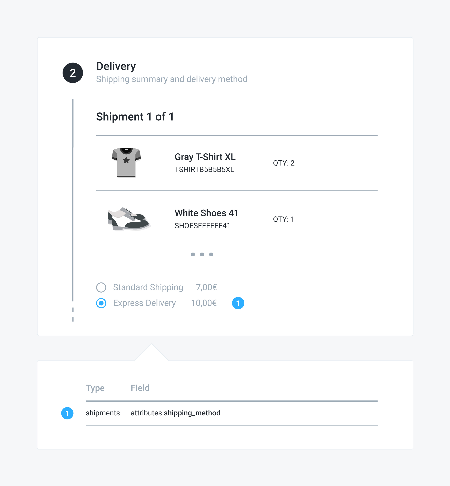

# Selecting a shipping method

## Problem

You have a pending order and you want to give your customer the possibility to select a shipping method for each of the order shipments.


## Solution

Within Commerce Layer, an order can have many shipments and each shipment must have a valid shipping method before the order can be placed. To let the customer select a shipping method, first you need to to get the list of available shipping methods for the order shipments and display them to the customer. Then you can associate the selected shipping method with the shipment. To do that:

1. Send a `GET` request to the `/api/orders/:id/shipments` endpoint, including the associated `available_shipping_methods`. 
2. Send a `PATCH` request to the `/api/shipments/:id` endpoint, setting its `shipping_method` relationship.

### Example

#### 1. Get the available shipping methods



The following request retrieves the list of available shipping methods associated with the shipments of the order identified by the "NgojhKoyYN" ID:

```javascript
curl -X GET \
  https://yourdomain.commercelayer.io/api/orders/NgojhKoyYN/shipments?include=available_shipping_methods \
  -H 'Authorization: Bearer your-access-token' \
  -H 'Accept: application/vnd.api+json'
```



On success, the API responds with a `200 OK` status code, returning the list of shipment  objects and the associated available shipping methods:

```javascript
{
  "data": [
    {
      "id": "kPzgnCjdQy",
      "type": "shipments",
      "links": {
        "self": "https://yourdomain.commercelayer.io/api/shipments/kPzgnCjdQy"
      },
      "attributes": {
        "number": "1234/S/001",
        "status": "upcoming",
        "currency_code": "EUR",
        "cost_amount_cents": 0,
        "cost_amount_float": 0.0,
        "formatted_cost_amount": "$0.00",
        "skus_count": 4,
        "created_at": "2018-01-01T12:00:00.000Z",
        "updated_at": "2018-01-01T12:00:00.000Z",
        "reference": null,
        "metadata": {}
      },
      "relationships": {
        "order": {
          "links": {...}
        },
        "shipping_category": {
          "links": {...}
        },
        "stock_location": {
          "links": {...}
        },
        "shipping_address": {
          "links": {...}
        },
        "shipping_method": {
          "links": {...}
        },
        "shipment_line_items": {
          "links": {...}
        },
        "available_shipping_methods": {
          "links": {...},
          "data": [
            {
              "type": "shipping_methods",
              "id": "WErDzFLeQN"
            },
            {
              "type": "shipping_methods",
              "id": "DEqjzFMykO"
            }
          ]
        },
        "parcels": {
          "links": {...}
        },
        "attachments": {...}
        }
      },
      "meta": {
          "mode": "test"
      }
    }
  ],
  "included": [
    {
      "id": "WErDzFLeQN",
      "type": "shipping_methods",
      "links": {
          "self": "https://yourdomain.commercelayer.io/api/shipping_methods/WErDzFLeQN"
      },
      "attributes": {
        "name": "Standard Shipping",
        "disabled_at": null,
        "currency_code": "EUR",
        "price_amount_cents": 700,
        "price_amount_float": 7.0,
        "formatted_price_amount": "€7,00",
        "free_over_amount_cents": 9900,
        "free_over_amount_float": 99.0,
        "formatted_free_over_amount": "€99,00",
        "price_amount_for_shipment_cents": 0,
        "price_amount_for_shipment_float": 0.0,
        "formatted_price_amount_for_shipment": "€0,00",
        "created_at": "2018-01-01T12:00:00.000Z",
        "updated_at": "2018-01-01T12:00:00.000Z",
        "reference": null,
        "metadata": {}
      },
      "relationships": {
        "market": {
          "links": {...}
        },
        "shipping_zone": {
          "links": {...}
        },
        "shipping_category": {
          "links": {...}
        },
        "delivery_lead_time_for_shipment": {
          "links": {...}
        }
      },
      "meta": {
        "mode": "test"
      }
    },
    {
      "id": "DEqjzFMykO",
      "type": "shipping_methods",
      "links": {
        "self": "https://yourdomain.commercelayer.io/api/shipping_methods/DEqjzFMykO"
      },
      "attributes": {
        "name": "Express Delivery",
        "disabled_at": null,
        "currency_code": "EUR",
        "price_amount_cents": 1000,
        "price_amount_float": 10.0,
        "formatted_price_amount": "€10,00",
        "free_over_amount_cents": null,
        "free_over_amount_float": null,
        "formatted_free_over_amount": null,
        "price_amount_for_shipment_cents": 1000,
        "price_amount_for_shipment_float": 10.0,
        "formatted_price_amount_for_shipment": "€10,00",
        "created_at": "2018-01-01T12:00:00.000Z",
        "updated_at": "2018-01-01T12:00:00.000Z",
        "reference": null,
        "metadata": {}
      },
      "relationships": {
        "market": {
          "links": {..}
        },
        "shipping_zone": {
          "links": {...}
        },
        "shipping_category": {
          "links": {...}
        },
        "delivery_lead_time_for_shipment": {
          "links": {...}
        }
      },
      "meta": {
        "mode": "test"
      }
    }
  ],
  "meta": {
    "record_count": 1,
    "page_count": 1
  },
  "links": {
      "first": "https://yourdomain.commercelayer.io/api/orders/NgojhKoyYN/shipments?include=available_shipping_methodss&page[number]=1&page[size]=10",
      "last": "https://yourdomain.commercelayer.io/api/orders/NgojhKoyYN/shipments?include=available_shipping_methodss&page[number]=1&page[size]=10"
  }
}
```



#### 2. Select a shipping method



The following request associated the selected shipping method \(identified by the "DEqjzFMykO" ID\) with the shipment identified by the "kPzgnCjdQy" ID:

```javascript
curl -X PATCH \
  https://yourdomain.commercelayer.io/api/shipments/kPzgnCjdQy \
  -H 'Authorization: Bearer your-access-token' \
  -H 'Accept: application/vnd.api+json' \
  -H 'Content-Type: application/vnd.api+json' \
  -d '{
    "data": {
      "type": "shipments",
      "id": "kPzgnCjdQy",
      "relationships": {
        "shipping_method": {
          "data": {
            "type": "shipping_methods",
            "id": "DEqjzFMykO"
          }
        }
      }
    }
  }'
```



On success, the API responds with a `200 OK` status code, returning the updated shipment object:

```javascript
{
  "data": {
    "id": "kPzgnCjdQy",
    "type": "shipments",
    "links": {
        "self": "https://yourdomain.commercelayer.io/api/shipments/kPzgnCjdQy"
    },
    "attributes": {
      "number": "1234/S/001",
      "status": "upcoming",
      "currency_code": "EUR",
      "cost_amount_cents": 0,
      "cost_amount_float": 0.0,
      "formatted_cost_amount": "$0.00",
      "skus_count": 4,
      "created_at": "2018-01-01T12:00:00.000Z",
      "updated_at": "2018-01-01T12:00:00.000Z",
      "reference": null,
      "metadata": {}
    },
    "relationships": {
      "order": {
        "links": {...}
      },
      "shipping_category": {
        "links": {...}
      },
      "stock_location": {
        "links": {...}
      },
      "shipping_address": {
        "links": {...}
      },
      "shipping_method": {
        "links": {...}
      },
      "shipment_line_items": {
        "links": {...}
      },
      "available_shipping_methods": {
        "links": {...}
      },
      "parcels": {
        "links": {...}
      },
      "attachments": {
        "links": {...}
      }
    },
    "meta": {
      "mode": "test"
    }
  }
}
```



### Mapping

The image below shows how the related action during the checkout process is mapped to a specific attribute of the shipment object.



## Additional notes

#### Purchasing gift cards

When purchasing digital products — i.e. gift cards — no shipments are created for the order, therefore the order can be placed without any shipping method.

## More to read

See our API reference if you need more information about the [shipping method](https://docs.commercelayer.io/api/resources/shipping_methods) and [gift card](https://docs.commercelayer.io/api/resources/gift_cards) objects or on how to [update a shipment](https://docs.commercelayer.io/api/resources/shipments/update_shipment) or [include associations](https://docs.commercelayer.io/api/including-associations).


