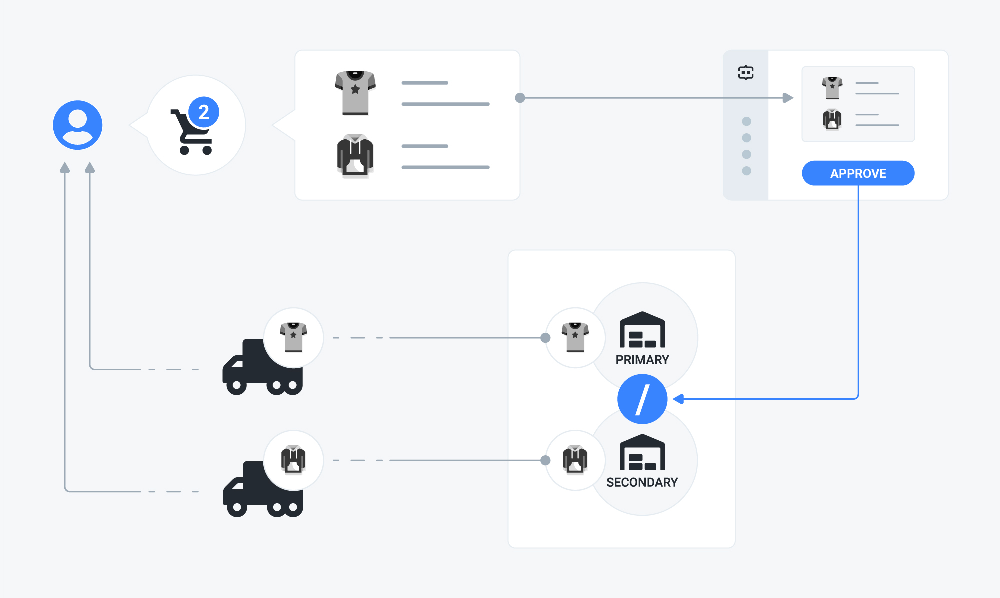

# Split shipments

## Problem

You have an order containing several SKUs, whose stock is available on different locations and — eventually — belonging to multiple shipping categories. You want to create the shipments from all the stock locations to fulfill the order line items.



## Solution

You need to use the **split shipments** strategy, which is the default one. To do that, check the related option in the admin UI or send a `PATCH` request to the `inventory_models/:id` endpoint, setting the strategy attribute accordingly.

### Example



The following request explicitly updates the strategy for the inventory model identified by the "BwAezhyOQw" ID:

```javascript
curl -X PATCH \
  http://yourdomain.commercelayer.io/api/inventory_models/BwAezhyOQw \
  -H 'Accept: application/vnd.api+json' \
  -H 'Authorization: Bearer your-access-token' \
  -H 'Content-Type: application/vnd.api+json' \
  -d '{
  "data": {
    "type": "inventory_modeld",
    "id": "BwAezhyOQw",
    "attributes": {
      "strategy": "split_shipments"
    }
  }
}'
```



On success, the API responds with a `200 OK` status code, returning the updated inventory model object:

```javascript
{
  "data": {
    "id": "BwAezhyOQw",
    "type": "inventory_models",
    "links": {
      "self": "https://yourdomain.commercelayer.io/api/inventory_models/BwAezhyOQw"
    },
    "attributes": {
      "name": "EU Inventory Model",
      "strategy": "split_shipments",
      "stock_locations_cutoff": 3,
      "created_at": "2018-01-01T12:00:00.000Z",
      "updated_at": "2018-01-01T12:00:00.000Z",
      "reference": "ANY-EXTERNAL-REFEFERNCE",
      "reference_origin": "ANY-EXTERNAL-REFEFERNCE-ORIGIN",
      "metadata": {
        "foo": "bar"
      }
    },
    "relationships": {
      "inventory_stock_locations": {
        "links": {
          "self": "https://yourdomain.commercelayer.io/api/inventory_models/xYZkjABcde/relationships/inventory_stock_locations",
          "related": "https://yourdomain.commercelayer.io/api/inventory_models/xYZkjABcde/inventory_stock_locations"
        }
      },
      "inventory_return_locations": {
        "links": {
          "self": "https://yourdomain.commercelayer.io/api/inventory_models/xYZkjABcde/relationships/inventory_return_locations",
          "related": "https://yourdomain.commercelayer.io/api/inventory_models/xYZkjABcde/inventory_return_locations"
        }
      },
      "attachments": {
        "links": {
          "self": "https://yourdomain.commercelayer.io/api/inventory_models/xYZkjABcde/relationships/attachments",
          "related": "https://yourdomain.commercelayer.io/api/inventory_models/xYZkjABcde/attachments"
        }
      }
    },
    "meta": {
      "mode": "test"
    }
  }
}
```



## How it works

This inventory strategy affects the creation of the resources involved in the process by the following logic.

#### Shipments

All the stock locations are checked in order of priority. If the primary stock location can fulfill all SKUs associated with the order, just one shipment is created from that stock location. Otherwise, one or more shipments are created from the secondary locations.

#### Stock line items

Each SKU associated with the order generates a stock line item that is also linked to the stock location from which its quantity will be fulfilled.

#### Shipping categories

In case the order contains SKUs belonging to different shipping categories, a shipment is created for each shipping category. As for the rest, shipments splitting logic still works as described above.

## Additional notes

#### Do not ship SKU

If an SKU is marked with the `do_not_ship` flag, no shipment is generated for it. 


This option still tracks inventory by creating stock line items.


#### Do not track SKU

If an SKU is marked with the `do_not_track` flag, no stock line item is generated for it. 


This option still generates shipments.


## More to read

See our API reference if you need more information on how to [update an inventory model](https://docs.commercelayer.io/api/resources/inventory_models/update_inventory_model) or if you want more information about [SKUs](https://docs.commercelayer.io/api/resources/skus), [shipments](https://docs.commercelayer.io/api/resources/inventory_models/update_inventory_model), [stock transfers](https://docs.commercelayer.io/api/resources/stock_transfers), and [stock line items](https://docs.commercelayer.io/api/resources/stock_line_items).

