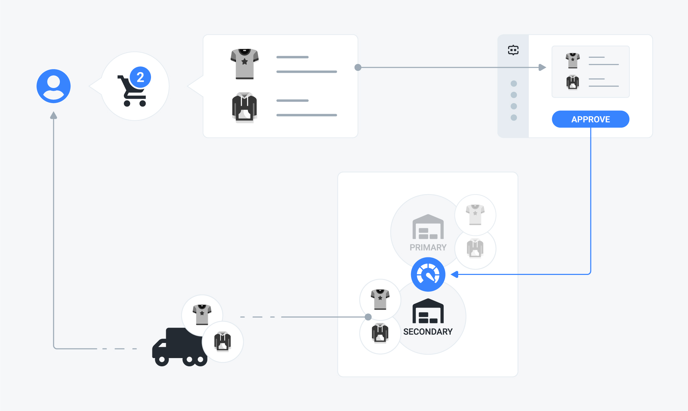

# Ship from first available \(or primary\)

## Problem

You have an order containing several SKUs, whose stock is available on different locations and — eventually — belonging to multiple shipping categories. You want to minimize the number of shipments and stock transfers by relying on the stock location that can fulfill all the SKUs first and fall back performing the necessary stock transfers to the primary stock location otherwise.



## Solution

You need to use the **ship from first available \(or primary\)** strategy. To do that, check the related option in the admin UI or send a `PATCH` request to the `inventory_models/:id` endpoint, setting the strategy attribute accordingly.

### Example



The following request updates the strategy for the inventory model identified by the "BwAezhyOQw" ID:

```javascript
curl -X PATCH \
  http://yourdomain.commercelayer.io/api/inventory_models/BwAezhyOQw \
  -H 'Accept: application/vnd.api+json' \
  -H 'Authorization: Bearer your-access-token' \
  -H 'Content-Type: application/vnd.api+json' \
  -d '{
  "data": {
    "type": "inventory_modeld",
    "id": "BwAezhyOQw",
    "attributes": {
      "strategy": "ship_from_first_available_or_primary"
    }
  }
}'
```



On success, the API responds with a `200 OK` status code, returning the updated inventory model object:

```javascript
{
  "data": {
    "id": "BwAezhyOQw",
    "type": "inventory_models",
    "links": {
      "self": "https://yourdomain.commercelayer.io/api/inventory_models/BwAezhyOQw"
    },
    "attributes": {
      "name": "EU Inventory Model",
      "strategy": "ship_from_first_available_or_primary",
      "stock_locations_cutoff": 3,
      "created_at": "2018-01-01T12:00:00.000Z",
      "updated_at": "2018-01-01T12:00:00.000Z",
      "reference": "ANY-EXTERNAL-REFEFERNCE",
      "reference_origin": "ANY-EXTERNAL-REFEFERNCE-ORIGIN",
      "metadata": {
        "foo": "bar"
      }
    },
    "relationships": {
      "inventory_stock_locations": {
        "links": {
          "self": "https://yourdomain.commercelayer.io/api/inventory_models/xYZkjABcde/relationships/inventory_stock_locations",
          "related": "https://yourdomain.commercelayer.io/api/inventory_models/xYZkjABcde/inventory_stock_locations"
        }
      },
      "inventory_return_locations": {
        "links": {
          "self": "https://yourdomain.commercelayer.io/api/inventory_models/xYZkjABcde/relationships/inventory_return_locations",
          "related": "https://yourdomain.commercelayer.io/api/inventory_models/xYZkjABcde/inventory_return_locations"
        }
      },
      "attachments": {
        "links": {
          "self": "https://yourdomain.commercelayer.io/api/inventory_models/xYZkjABcde/relationships/attachments",
          "related": "https://yourdomain.commercelayer.io/api/inventory_models/xYZkjABcde/attachments"
        }
      }
    },
    "meta": {
      "mode": "test"
    }
  }
}
```



## How it works

This inventory strategy affects the creation of the resources involved in the process by the following logic.

#### Shipments

The first stock location that can fulfill all the SKUs associated with the order is considered for shipment creation. If there's no such stock location, the [primary one](transfer-to-primary.md#how-it-works) is used.

#### Stocks transfers

If there's a stock location that can fulfill all the SKUs associated with the order, no stock transfer is created. If there's no such stock location, one or more stock transfers are created from secondary locations to the primary one. Each stock transfer creates a stock line item once completed.

#### Stock line items

If there's a stock location that can fulfill all the SKUs associated with the order, the necessary stock line items are generated from the fulfilled SKUs. If there's no such stock location, only the SKUs fulfilled by the primary stock location generate stock line items, each of the other ones generate a stock transfer.

#### Shipping categories

In case the order contains SKUs belonging to different shipping categories and there's a stock location that can fulfill all the SKUs associated with the order, a shipment for each shipping category is created from that stock location. If there's no such stock location, a shipment is created from the primary stock location for each shipping category. As for the rest, the logic still works as described above.

## Additional notes

#### Do not ship SKU

If an SKU is marked with the `do_not_ship` attribute, no shipment is generated for it.


This option still tracks inventory by creating the necessary stock line items and stock transfers.


#### Do not track SKU

If an SKU is marked with the `do_not_track` attribute, no stock line item and stock transfer are generated for it.


This option still generates shipments.


## More to read

See our API reference if you need more information on how to [update an inventory model](https://docs.commercelayer.io/api/resources/inventory_models/update_inventory_model) or if you want more information about [SKUs](https://docs.commercelayer.io/api/resources/skus), [shipments](https://docs.commercelayer.io/api/resources/inventory_models/update_inventory_model), [stock transfers](https://docs.commercelayer.io/api/resources/stock_transfers), and [stock line items](https://docs.commercelayer.io/api/resources/stock_line_items).

