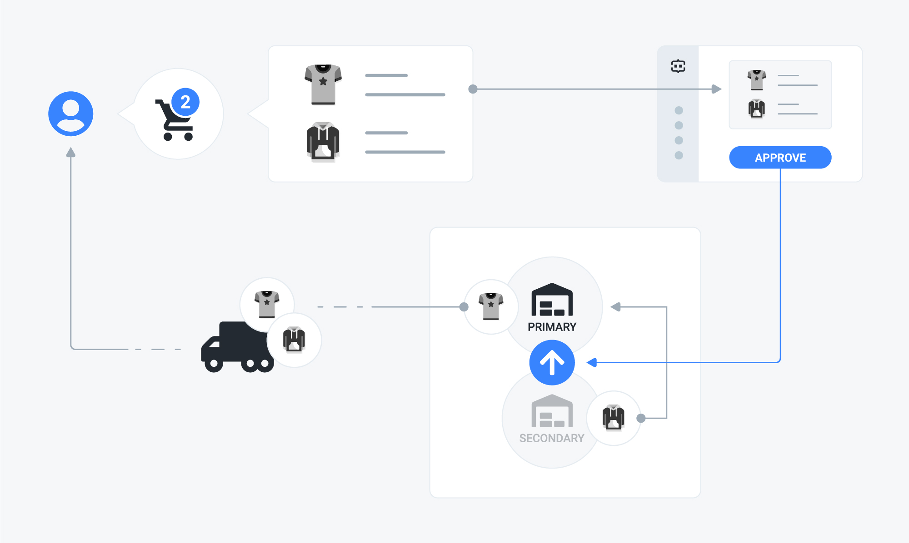

# Ship from primary

## Problem

You have an order containing several SKUs, whose stock is available on different locations and — eventually — belonging to multiple shipping categories. You want to create the shipments just from your primary stock location and perform stock transfers from the secondary locations to the primary one in case the latter cannot fulfill all the order line items.



## Solution

You need to use the **ship from primary** strategy. To do that, check the related option in the admin UI or send a `PATCH` request to the `inventory_models/:id` endpoint, setting the strategy attribute accordingly.

### Example



The following request updates the strategy for the inventory model identified by the "BwAezhyOQw" ID:

```javascript
curl -X PATCH \
  http://yourdomain.commercelayer.io/api/inventory_models/BwAezhyOQw \
  -H 'Accept: application/vnd.api+json' \
  -H 'Authorization: Bearer your-access-token' \
  -H 'Content-Type: application/vnd.api+json' \
  -d '{
  "data": {
    "type": "inventory_modeld",
    "id": "BwAezhyOQw",
    "attributes": {
      "strategy": "ship_from_primary"
    }
  }
}'
```



On success, the API responds with a `200 OK` status code, returning the updated inventory model object:

```javascript
{
  "data": {
    "id": "BwAezhyOQw",
    "type": "inventory_models",
    "links": {
      "self": "https://yourdomain.commercelayer.io/api/inventory_models/BwAezhyOQw"
    },
    "attributes": {
      "name": "EU Inventory Model",
      "strategy": "ship_from_primary",
      "stock_locations_cutoff": 3,
      "created_at": "2018-01-01T12:00:00.000Z",
      "updated_at": "2018-01-01T12:00:00.000Z",
      "reference": "ANY-EXTERNAL-REFEFERNCE",
      "reference_origin": "ANY-EXTERNAL-REFEFERNCE-ORIGIN",
      "metadata": {
        "foo": "bar"
      }
    },
    "relationships": {
      "inventory_stock_locations": {
        "links": {
          "self": "https://yourdomain.commercelayer.io/api/inventory_models/xYZkjABcde/relationships/inventory_stock_locations",
          "related": "https://yourdomain.commercelayer.io/api/inventory_models/xYZkjABcde/inventory_stock_locations"
        }
      },
      "inventory_return_locations": {
        "links": {
          "self": "https://yourdomain.commercelayer.io/api/inventory_models/xYZkjABcde/relationships/inventory_return_locations",
          "related": "https://yourdomain.commercelayer.io/api/inventory_models/xYZkjABcde/inventory_return_locations"
        }
      },
      "attachments": {
        "links": {
          "self": "https://yourdomain.commercelayer.io/api/inventory_models/xYZkjABcde/relationships/attachments",
          "related": "https://yourdomain.commercelayer.io/api/inventory_models/xYZkjABcde/attachments"
        }
      }
    },
    "meta": {
      "mode": "test"
    }
  }
}
```



## How it works

This inventory strategy affects the creation of the resources involved in the process by the following logic.

#### Shipments

Only the primary stock location is considered for shipment creation.

#### Stocks transfers

If the primary stock location can fulfill all the SKUs associated with the order, no stock transfers are created. Otherwise, one or more stock transfers are created from the secondary locations to the primary one. Each stock transfer creates a stock line item once completed.

#### Stock line items

Only the SKUs fulfilled by the primary stock location generate stock line items. Each of the other SKUs generates a stock transfer.

#### Shipping categories

In case the order contains SKUs belonging to different shipping categories, a shipment is created from the primary stock location for each shipping category. As for the rest, the logic still works as described above.

## Additional notes

#### Do not ship SKU

If an SKU is marked with the `do_not_ship` flag, no shipment is generated for it. 


This option still tracks inventory by creating the necessary stock line items and stock transfers.


#### Do not track SKU

If an SKU is marked with the `do_not_track` flag, no stock line item and stock transfer are generated for it. 


This option still generates shipments.


## More to read

See our API reference if you need more information on how to [update an inventory model](https://docs.commercelayer.io/api/resources/inventory_models/update_inventory_model) or if you want more information about [SKUs](https://docs.commercelayer.io/api/resources/skus), [shipments](https://docs.commercelayer.io/api/resources/inventory_models/update_inventory_model), [stock transfers](https://docs.commercelayer.io/api/resources/stock_transfers), and [stock line items](https://docs.commercelayer.io/api/resources/stock_line_items).

