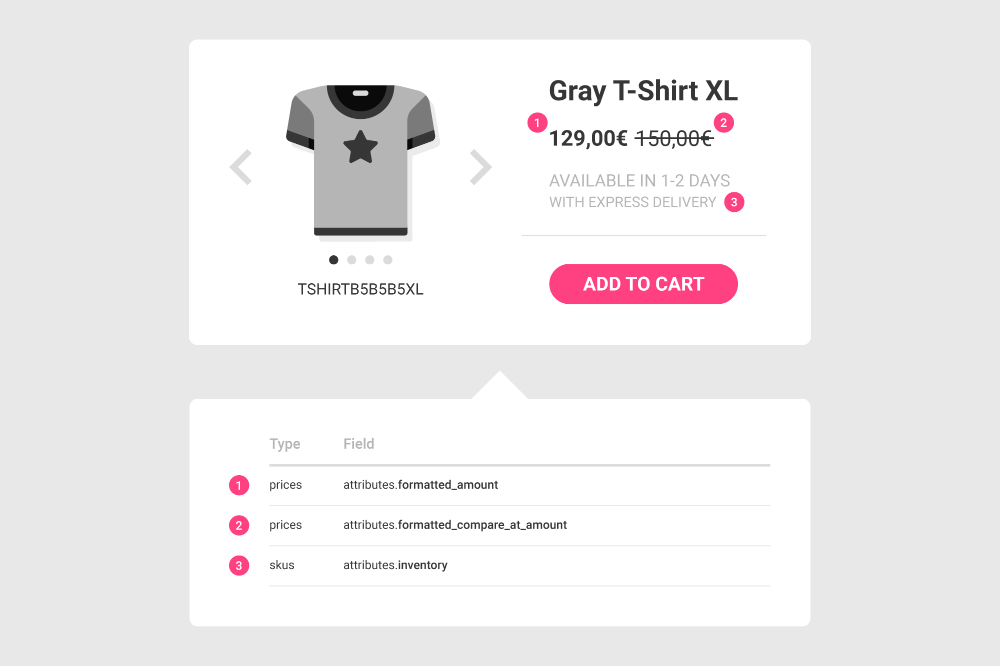

# Product page

## The Problem

You've created a product page with your favorite CMS and now you want to display the price and the availability of the selected product. You also need to implement the "add to cart" function on the related button. The image below shows the three main dynamic elements of the page \(selling price, full price and inventory information\) and how each of these are mapped to a specific field of the SKU or price objects.



## Solution

To retrieve the price and availability of a SKU, send a `GET` request to the `/api/skus/:id` endpoint.

### Example



The following request retrieves the price and the availability of the SKU identified by the "aBmNkPQRst" ID:

```javascript
curl -X GET \
  https://yourdomain.commercelayer.io/api/skus/aBmNkPQRst?include=prices \
  -H 'Accept: application/vnd.api+json' \
  -H 'Authorization: Bearer your-access-token'
```



On success, the API responds with a `200 OK` status code, returning the SKU object with the price and inventory included:

```javascript
{
  "data": {
    "id": "aBmNkPQRst",
    "type": "skus",
    "links": {
      "self": "https://yourdomain.commercelayer.io/api/skus/aBmNkPQRst"
    },
    "attributes": {
      "code": "TSHIRTB5B5B5XL",
      "name": "Gray T-Shirt XL",
      "description": "Gray cotton t-shirt. Short sleeves and a round neckline. Unique high quality design.",
      "image_url": "https://img.yourdomain.com/skus/TSHIRTB5B5B5XL.png",
      "tag_names": "",
      "pieces_per_pack": null,
      "weight": null,
      "unit_of_weight": null,
      "inventory": {
        "available": true,
        "quantity": 10,
        "levels": [
          {
            "quantity": 6,
            "delivery_lead_times": [
              {
                "shipping_method": {
                  "name": "Standard Shipping",
                  "reference": null,
                  "price_amount_cents": 700,
                  "free_over_amount_cents": 9900,
                  "formatted_price_amount": "€7,00",
                  "formatted_free_over_amount": "€99,00"
                },
                "min": {
                  "hours": 72,
                  "days": 3
                },
                "max": {
                  "hours": 120,
                  "days": 5
                }
              },
              {
                "shipping_method": {
                  "name": "Express Delivery",
                  "reference": null,
                  "price_amount_cents": 1000,
                  "free_over_amount_cents": null,
                  "formatted_price_amount": "€10,00",
                  "formatted_free_over_amount": null
                },
                "min": {
                  "hours": 24,
                  "days": 1
                },
                "max": {
                  "hours": 48,
                  "days": 2
                }
              }
            ]
          },
          {
            "quantity": 4,
            "delivery_lead_times": [
              {
                "shipping_method": {
                  "name": "Standard Shipping",
                  "reference": null,
                  "price_amount_cents": 700,
                  "free_over_amount_cents": 9900,
                  "formatted_price_amount": "€7,00",
                  "formatted_free_over_amount": "€99,00"
                },
                "min": {
                  "hours": 72,
                  "days": 3
                },
                "max": {
                  "hours": 5,
                  "days": 120
                }
              },
              {
                "shipping_method": {
                  "name": "Express Delivery",
                  "reference": null,
                  "price_amount_cents": 1000,
                  "free_over_amount_cents": null,
                  "formatted_price_amount": "€10,00",
                  "formatted_free_over_amount": null
                },
                "min": {
                  "hours": 24,
                  "days": 1
                },
                "max": {
                  "hours": 48,
                  "days": 2
                }
              }
            ]
          }
        ]
      },
      "created_at": "2018-01-01T12:00:00.000Z",
      "updated_at": "2018-01-01T12:00:00.000Z",
      "reference": null,
      "metadata": {}
    },
    "relationships": {
      "shipping_category": {
        "links": {...}
      },
      "prices": {
        "links": {...},
        "data": [
          {
            "type": "prices",
            "id": "pYwMUWJRzg"
          }
        ]
      },
      "stock_items": {
        "links": {...}
      },
      "delivery_lead_times": {
        "links": {...}
      },
      "sku_options": {
        "links": {...}
      }
    },
    "meta": {
      "mode": "test"
    }
  },
  "included": [
    {
      "id": "pYwMUWJRzg",
      "type": "prices",
      "links": {
        "self": "https://yourdomain.commercelayer.io/api/prices/pYwMUWJRzg"
      },
      "attributes": {
        "currency_code": "EUR",
        "sku_code": "TSHIRTB5B5B5XL",
        "amount_cents": 12900,
        "amount_float": 129.0,
        "formatted_amount": "€129,00",
        "compare_at_amount_cents": 15000,
        "compare_at_amount_float": 150.0,
        "formatted_compare_at_amount": "€150,00",
        "created_at": "2018-01-01T12:00:00.000Z",
        "updated_at": "2018-01-01T12:00:00.000Z",
        "reference": null,
        "metadata": {}
      },
      "relationships": {
        "price_list": {
          "links": {...}
        },
        "sku": {
          "links": {...}
        }
      },
      "meta": {
        "mode": "test"
      }
    }
  ]
}
```




For performance reasons, the `inventory` information is only returned when fetching a single SKU.


To implement the "add to cart" function, please refer to this guide:



## Additional notes

#### Getting the SKU ID from its code

If you have the SKU code and you want to retrieve the related ID, send a `GET` request to the `/api/skus` endpoint and filter it by code, taking care to request the ID field only.



The following request retrieves the ID of the SKU identified by the code "TSHIRTB5B5B5XL":

```javascript
curl -X GET \
  https://yourdomain.commercelayer.io/api/skus?filter[q][code_eq]=TSHIRTB5B5B5XL&fields[skus]=id \
  -H 'Accept: application/vnd.api+json' \
  -H 'Authorization: Bearer your-access-token'
```



On success, the API responds with a `200 OK` status code, returning the single SKU object and showing only the ID field:

```javascript
{
  "data": [
    {
      "id": "aBmNkPQRst",
      "type": "skus",
      "links": {
        "self": "https://yourdomain.commercelayer.io/api/skus/aBmNkPQRst"
      },
      "meta": {
        "mode": "test"
      }
    }
  ],
  "meta": {
    "record_count": 1,
    "page_count": 1
  },
  "links": {
    "first": "https://yourdomain.commercelayer.io/api/skus?filter[q][code_eq]=TSHIRTB5B5B5XL&fields[skus]=id&page[number]=1&page[size]=10",
    "last": "https://yourdomain.commercelayer.io/api/skus?filter[q][code_eq]=TSHIRTB5B5B5XL&&fields[skus]=id&page[number]=1&page[size]=10"
  }
}
```



#### Getting a list of SKU prices

If you need to display the prices associated to a list of SKUs \(with no inventory information\) send a `GET` request to the `/api/skus` endpoint, filter it by code, and include the SKU prices.



The following request retrieves the prices of the SKU identified by the "TSHIRTB5B5B5XL" code:

```javascript
curl -X GET \
  https://yourdomain.commercelayer.io/api/skus?filter[q][code_eq]=TSHIRTB5B5B5XL&include=prices \
  -H 'Accept: application/vnd.api+json' \
  -H 'Authorization: Bearer your-access-token'
```



On success, the API responds with a `200 OK` status code, returning the SKU object with the price included:

```javascript
{
  "data": [
    {
      "id": "aBmNkPQRst",
      "type": "skus",
      "links": {
        "self": "https://yourdomain.commercelayer.io/api/skus/aBmNkPQRst"
      },
    "attributes": {
        "code": "TSHIRTB5B5B5XL",
        "name": "Gray T-Shirt XL",
        "description": "Gray cotton t-shirt. Short sleeves and a round neckline. Unique high quality design.",
        "image_url": "https://img.yourdomain.com/skus/TSHIRTB5B5B5XL.png",
        "tag_names": "",
        "pieces_per_pack": null,
        "weight": null,
        "unit_of_weight": null,
        "created_at": "2018-01-01T12:00:00.000Z",
        "updated_at": "2018-01-01T12:00:00.000Z",
        "reference": null,
        "metadata": {}
      },
      "relationships": {
        "shipping_category": {
          "links": {...}
        },
        "prices": {
          "links": {...},
          "data": [
            {
              "type": "prices",
              "id": "pYwMUWJRzg"
            }
          ]
        },
        "stock_items": {
          "links": {...}
        },
        "delivery_lead_times": {
          "links": {...}
        },
        "sku_options": {
          "links": {...}
        }
      },
      "meta": {
        "mode": "test"
      }
    }
  ],
  "included": [
    {
      "id": "pYwMUWJRzg",
      "type": "prices",
      "links": {
        "self": "https://yourdomain.commercelayer.io/api/prices/pYwMUWJRzg"
      },
      "attributes": {
        "currency_code": "EUR",
        "sku_code": "TSHIRTB5B5B5XL",
        "amount_cents": 12900,
        "amount_float": 129.0,
        "formatted_amount": "€29,00",
        "compare_at_amount_cents": 15000,
        "compare_at_amount_float": 150.0,
        "formatted_compare_at_amount": "€150,00",
        "created_at": "2018-01-01T12:00:00.000Z",
        "updated_at": "2018-01-01T12:00:00.000Z",
        "reference": null,
        "metadata": {}
      },
      "relationships": {
        "price_list": {
          "links": {...}
        },
        "sku": {
          "links": {...}
        }
      },
      "meta": {
        "mode": "test"
      }
    }
  ],
  "meta": {
    "record_count": 1,
    "page_count": 1
  },
  "links": {
    "first": "https://yourdomain.commercelayer.io/api/skus?filter[q][code_eq]=TSHIRTMM000000E63E74LXXX&include=prices&page[number]=1&page[size]=10",
    "last": "https://yourdomain.commercelayer.io/api/skus?filter[q][code_eq]=TSHIRTMM000000E63E74LXXX&include=prices&page[number]=1&page[size]=10"
  }
}
```



## More to read

See our API reference if you need more information on how to [filter data](https://docs.commercelayer.io/api/filtering-data), [include associations](https://docs.commercelayer.io/api/including-associations), and manage [sparse fieldsets](https://docs.commercelayer.io/api/sparse-fieldsets) or if you want to have an overview of all the specific [permissions and restrictions](https://docs.commercelayer.io/api/roles-and-permissions#sales-channel) set for a sales channel application.

