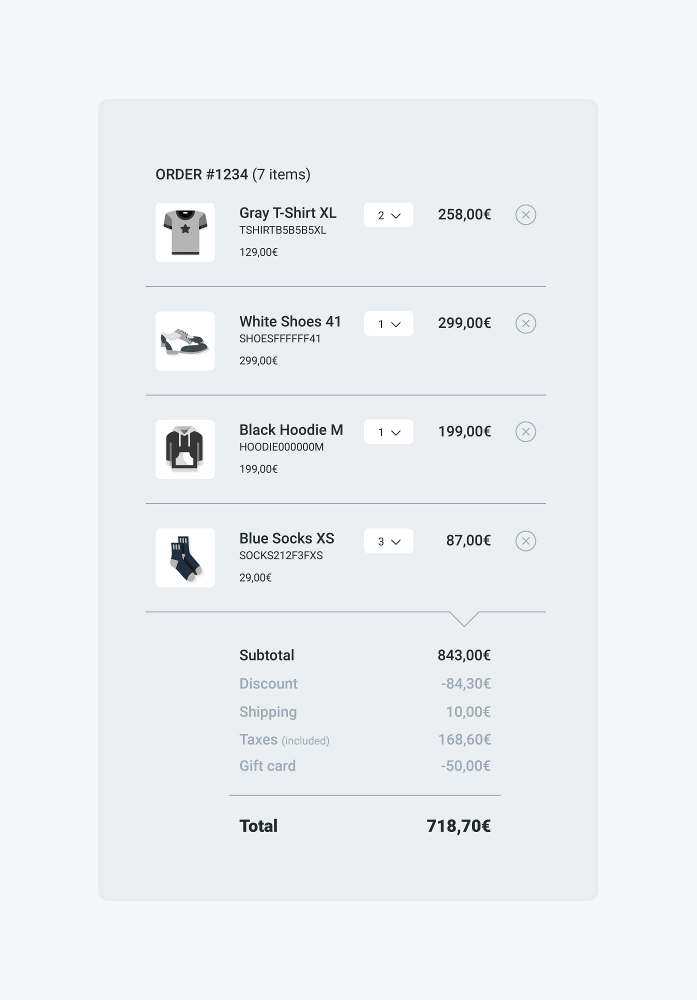

# Displaying the cart summary

## Problem

You want to display an order summary to your customer, including the order line items and totals. 



## Solution

To retrieve the list of line items that compose an order summary, send a `GET` request to the `/api/orders/:id` endpoint and include its line items.


To get a faster response and fewer data to parse, we recommend requesting only the fields you need to show in the cart summary. 


### Example



The following request fetches the list of line items associated with the order identified by the "yzkWXfgHQS" ID, with a specific selection of the fields you need to show in the cart summary:

```javascript
curl -X GET \
  'https://yourdomain.commercelayer.io/api/orders/yzkWXfgHQS?include=line_items&fields[orders]=number,skus_count,formatted_subtotal_amount,formatted_discount_amount,formatted_shipping_amount,formatted_total_tax_amount,formatted_gift_card_amount,formatted_total_amount_with_taxes,line_items&fields[line_items]=item_type,image_url,name,sku_code,formatted_unit_amount,quantity,formatted_total_amount' \
  -H 'Accept: application/vnd.api+json' \
  -H 'Authorization: Bearer your-access-token'
```



On success, the API responds with a `200 OK` status code, returning the order object with all the line items included, showing only the requested fieldset:

```javascript
{
  "data": {
    "id": "yzkWXfgHQS",
    "type": "orders",
    "links": {
      "self": "https://yourdomain.commercelayer.io/api/orders/yzkWXfgHQS"
    },
    "attributes": {
      "number": 1234,
      "skus_count": 7,
      "formatted_subtotal_amount": "843.00€",
      "formatted_discount_amount": "-84.30€",
      "formatted_shipping_amount": "10.00€",
      "formatted_total_tax_amount": "168.60€",
      "formatted_gift_card_amount": "-50.00€",
      "formatted_total_amount_with_taxes": "718.70€"
    },
    "relationships": {
      "line_items": {
        "links": {...},
        "data": [
          {
            "type": "line_items",
            "id": "aBmNkPQRst"
          },
          {
            "type": "line_items",
            "id": "kXBqtVaYMN"
          },
          {
            "type": "line_items",
            "id": "ypQptRQABk"
          },
          {
            "type": "line_items",
            "id": "yaoMtJoqjv"
          },
          {
            "other": "... line items"
          }
        ]
      }
    },
    "meta": {
      "mode": "test"
    }
},
"included": [
    {
      "id": "aBmNkPQRst",
      "type": "line_items",
      "links": {
          "self": "https://spineless.commercelayer.io/api/line_items/aBmNkPQRst"
      },
      "attributes": {
        "item_type": "skus",
        "image_url": "https://img.yourdomain.com/skus/TSHIRTB5B5B5XL.png",
        "name": "Grey T-Shirt XL",
        "sku_code": "TSHIRTB5B5B5XL",
        "formatted_unit_amount": "129.00€",
        "quantity": 2,
        "formatted_total_amount": "258.00€"
      },
      "meta": {
        "mode": "test"
      }
    },
    {
      "id": "kXBqtVaYMN",
      "type": "line_items",
      "links": {
        "self": "https://spineless.commercelayer.io/api/line_items/kXBqtVaYMN"
      },
      "attributes": {
        "item_type": "skus",
        "image_url": "https://img.yourdomain.com/skus/SHOESFFFFFF41.png",
        "name": "White Shoes 41",
        "sku_code": "SHOESFFFFFF41",
        "formatted_unit_amount": "299.00€",
        "quantity": 1,
        "formatted_total_amount": "299.00€"
      },
      "meta": {
        "mode": "test"
      }
    },
    {
      "id": "ypQptRQABk",
      "type": "line_items",
      "links": {
        "self": "https://spineless.commercelayer.io/api/line_items/ypQptRQABk"
      },
      "attributes": {
        "item_type": "skus",
        "image_url": "https://img.yourdomain.com/skus/HOODIE000000M.png",
        "name": "Black Hoodie M",
        "sku_code": "HOODIE000000M",
        "formatted_unit_amount": "199.00€",
        "quantity": 1,
        "formatted_total_amount": "199.00€"
      },
      "meta": {
        "mode": "test"
      }
    },
    {
      "id": "yaoMtJoqjv",
      "type": "line_items",
      "links": {
        "self": "https://spineless.commercelayer.io/api/line_items/yaoMtJoqjv"
      },
      "attributes": {
        "item_type": "skus",
        "image_url": "https://img.yourdomain.com/skus/SOCKS212F3FXS.png",
        "name": "Blue Socks XS",
        "sku_code": "SOCKS212F3FXS",
        "formatted_unit_amount": "29.00€",
        "quantity": 3,
        "formatted_total_amount": "87.00€"
      },
      "meta": {
        "mode": "test"
      }
    },
    {
      "other": "... line items (different item types)"
    }
  ]
}
```



### Mapping

The image below shows how each of the elements of the shopping cart is mapped to a specific field of the order or line item objects. 


## Additional notes

#### Filtering by item type

You may have noticed the pseudo-code `{ "other": "... line items (different item types)" }` in the response. That's because the above request fetches **all** the line items associated with the order \(SKUs, shipments, payment methods, and promotions\). If you plan to use only some of them, remember to properly filter them through some client-side logic based on their `item_type` attribute.

#### Showing the payment method cost

Commerce Layer supports the option for payment methods to have a cost. If that's your case and you want to display it in the cart summary, remember to add also the `formatted_payment_method_amount` order's field in the [API call above](displaying-the-cart-summary.md#example). 

## More to read

See our API reference if you need more information on how to [retrieve an order](https://docs.commercelayer.io/api/resources/orders/retrieve_order). For further details on how to use `include` and `fields` queries in your request, see [Including associations](https://docs.commercelayer.io/api/including-associations) and [sparse fieldset](https://docs.commercelayer.io/api/sparse-fieldsets). 

