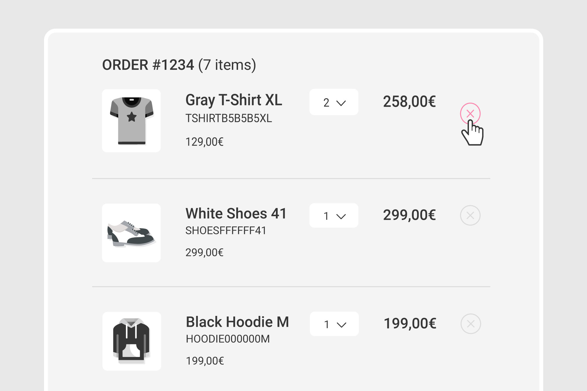

# Removing products from cart

## Problem

You have some items in your shopping cart and you want to remove one of them. 



## Solution

Removing a product \(SKU\) from your shopping cart means deleting an existing line item. To do that, send a `DELETE` request to the `/api/line_items/:id` endpoint. 

### Example



The following request removes the line item identified by the "aBmNkPQRst" ID from your shopping cart:

```javascript
curl -X DELETE \
  http://yourdomain.commercelayer.io/api/line_items/aBmNkPQRst \
  -H 'Accept: application/vnd.api+json' \
  -H 'Authorization: Bearer your-access-token' \
  -H 'Content-Type: application/vnd.api+json' \
```



On success, the API responds with a `204 No Content` status code.



## More to read

See our API reference if you need more information on how to [delete a line item](https://docs.commercelayer.io/api/resources/line_items/delete_line_item).

